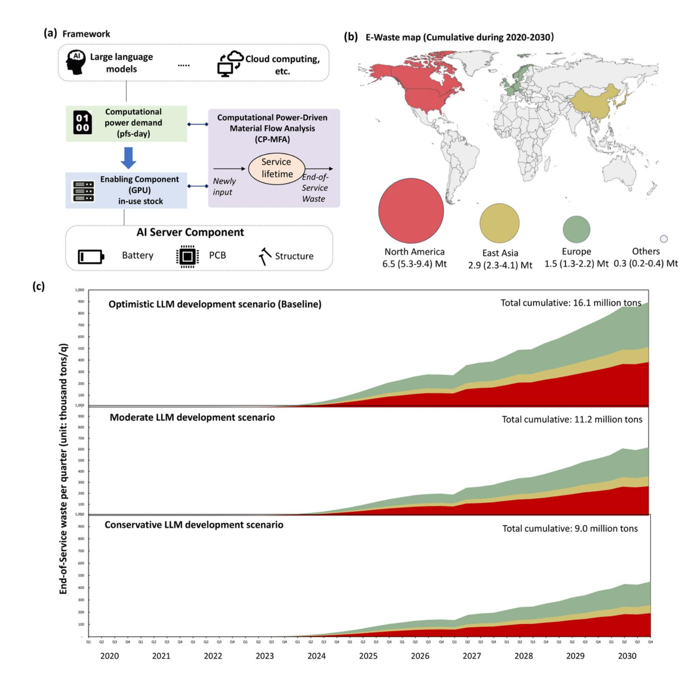
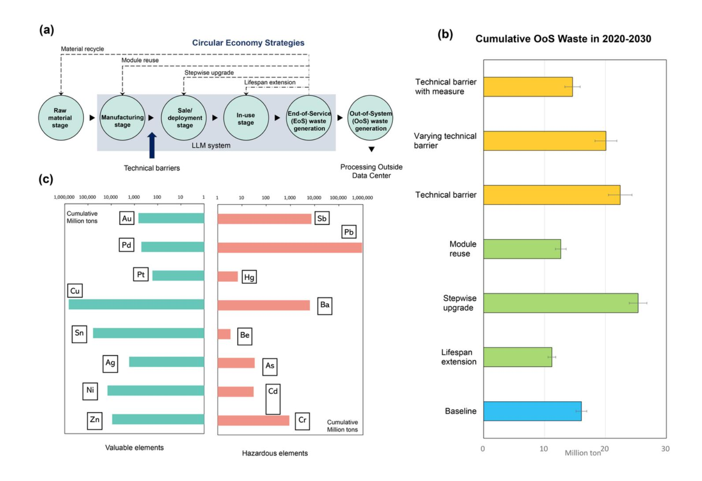

# E-waste Challenges of Generative Artificial Intelligence

Peng Wang

Institute of Urban Environment,Chinese Academy of Sciences <https://orcid.org/0000-0001-7170-1494>

Ling-Yu Zhang

Institute of Urban Environment, Chinese Academy of Sciences

Asaf Tzachor

Reichman University <https://orcid.org/0000-0002-4032-4996>

Eric Masanet

University of California, Santa Barbara

Wei-Qiang Chen

Institute of Urban Environment, Chinese Academy of Sciences <https://orcid.org/0000-0002-7686-2331>

Brief Communication

Keywords:

Posted Date: March 13th, 2024

DOI: <https://doi.org/10.21203/rs.3.rs-3978528/v1>

License: This work is licensed under a Creative Commons Attribution 4.0 International License.

Read Full [License](https://creativecommons.org/licenses/by/4.0/)

Additional Declarations: There is NO Competing Interest.

### **Abstract**

Generative artificial intelligence (GAI), a subset of artificial intelligence, requires substantial computational hardware resources for data processing and model training. However, the electronic-waste (E-waste) toll of GAI remains underexplored and overlooked. Here, we propose a Computational Power-driven Material Flow Analysis (CP-MFA) model to measure GAI-related E-waste generation, with a specific focus on large language models. By quantifying server requirements and E-waste generation of GAI under different scenarios, we find that this emerging waste stream will grow at a rapid pace (16 million tons cumulative waste by 2030) with deleterious environmental impacts. Accordingly, we call for an early adoption of circular economy measures among server manufacturers and data center operators. This study reveals significant hardware-linked environmental implications in the context of GAI boom.

### Introduction

Generative Artificial Intelligence (GAI) represents a pivotal advancement in the field of artificial intelligence (AI). GAI, including Large Language Models (LLMs), is capable of generating text, images, videos, or other types of content in response to input prompts. LLMs, a category of GAI that leverages Natural Language Processing (NLP) 1, are often trained on vast datasets and can be fine-tuned on domain-specific data to provide expert-level insights in certain fields2,3. This represents a significant advancement in NLP. LLMs require intensive computational power for training and inference, necessitating advanced computing hardware and infrastructure4. This demand has considerable environmental implications due to the energy consumption and carbon footprint associated with these operations5,6. The development of LLMs (such as GPT-4, BERT, ERNIE and DeBERTa), alongside successful GAI products in image and video generation, highlights the growing trend of global hardware facilities expansion to support future computing needs, and emphasizes the timeliness and importance of sustainable computing.

Previous studies of sustainable computing have focused on Al models' energy use and carbon emission7-10. However, the materials used during their lifecycle, and the waste stream of obsolete electronic equipment – known as electronic waste (E-waste) – received little-to-no attention. Indeed, as the fastest-growing waste stream11, E-waste, the materials it is composed of, and their potential impacts on public and planetary health, have long been recognized as a pressing global concern11,12.

As a response, in this Brief Communication, we propose a Computational Power-driven Material Flow Analysis model (CP-MFA, in Fig.1(a)) to quantify the prospective newly input, in-use stock, and end-of-service number of designated AI servers installed in data centers aimed to support LLMs computational requirements quarterly from 2020 to 2030. In our analysis, we focus on AI servers, leaving out ancillary machinery such as cooling units. Details of our approach can be found in **Section S1.1 of Supplementary Information**. Notably, our purpose is not to precisely predict the amount of AI servers and their related waste, but to provide initial gross estimates to appreciate the scale of the imminent E-waste challenge,

and explore the possible solutions to address the rising waste challenges. Hence, we develop different scenarios concerning different LLM development trends, consider feasible circular economy strategies, and other factors including geopolitical technical barriers (See Section S3 of Supplementary Information). We emphasize that the following numerical results contain uncertainties, but can reflect the overall tread of the whole GAI field.

We link the computational power with a gold standard benchmark server (an 8-units graphics processing unit (GPU) server is chosen as the proxy, such as the state-of-the-art Nvidia DGX H100 system published in 2023) to obtain conversion factor of computational power to physical infrastructure consisting GPUs, central processing units (CPUs), storage and memory units, internet communication modules, and power systems. Given future developments in digital electronics, we measure benchmark server's development by setting computational power intensity per server to exponential expansion according to Moore's Law. The choice of 8-units server is a balance of all major AI server types (4-units, 8-units and 16-units, in which 8-units are the most common). Although selecting 4-units or 16-units servers as the functional unit may result in different conversion factors, the qualitative results of total waste generation will stay unchanged.

To fully explore the possible futures of LLMs, we develop three scenarios where LLMs proliferate under three representative patterns in terms of global configurations of acceptance and utilization (**See Section S3.1 of Supplementary Information** for detailed hypotheses, configurations, and comparisons with existing projections). Fig.1(c) depicts the global increase of Al server amount on a quarterly basis for the three scenarios. These evaluations are traced to End-of-Service (EoS) E-waste generation, while their further treatments (e.g., refurbishing or material recycling) are not considered. In the optimistic scenario where LLMs become ubiquitous (i.e., everyone uses it on a daily basis such as social networks), the results indicate that the EoS E-waste stream from designated data centers would rise to approximate 16 million tons (Mt) within a decade from 2020 to 2030.

In view of the current conventional large-equipment E-waste stream defined by the UN, our estimated LLMs EoS E-waste will constitute roughly 11% of the global total during the same period 11. The compound annual growth rate (CAGR) of those LLMs-related E-waste will reach 110%, compared to the 2.8% of global conventional E-waste 11 such as screens and washing machines. In moderate and conservative scenarios (See Section S3.2 of Supplementary Information), these numbers will decrease to some extent but remain significant, nonetheless. The most conservative estimation is 8 Mt E-waste in cumulative, accounting for 6% of the global stream of E-waste with 90% CAGR. Given that data centers are highly geographically clustered, these waste streams will be mainly located in Europe (14%), North America (58%) and East Asia (25%) (see Fig.1(b)).

To address the impending E-waste challenge, circular economy strategies should be implemented 10. Accordingly, we develop and explore three strategic levers spanning different life cycle stages of servers to mitigate the Out-of-system (OoS) E-waste. The first strategic lever (C1) examines lifespan extension via improved maintenance in the use phase. The second strategic lever (C2) examines stepwise server

upgrading, indicating a conservative server purchase and deployment strategy. The third lever (C3) explores module reuse considering the reuse of key modules in the (re)manufacturing phase. To compare the potential efficacy of each strategy we examine, the optimistic LLM proliferation scenario is set as the baseline scenario. The detailed settings, potentials, and real-world practices of each strategy can be found in **Section S3.3 of Supplementary Information.** These strategies can alleviate OoS E-waste environmental impacts by implementing circular processes on the upstream EoS waste (as depicted in Fig.2(a)).

We find that cumulative OoS E-waste between 2020-2030 can be reduced by -58% to 30% (-9.3~4.9 Mt) depending on the chosen circular economy strategy, respectively. The most effective strategy is lifespan extension (C1, which is actively implemented by global operators) on condition that the average lifespan of servers is extended by 1 year in downcycling usage (where in specific cases it can be extended to six years, showing more significant effects). Similarly, module reuse strategy (C3) reduces E-waste by 21% (3.4 Mt). This measure refers to dismantling, renovation, and re-assemblage of critical modules of obsolete servers (GPU, CPU, battery, etc.), before they can be reused in downcycling computing. These strategies (C1 and C3) are expected to have immediate results while, the presumable effect of stepwise upgrading (C2) is fluctuating and potentially counter-effective (with 9.3 Mt more E-waste compared to baseline scenario, see more information in Section S3.3 in Supplementary Information). It indicates the purchase and upgrade of servers in data centers are stepwise as the major GPU update period is generally two-years, rather than the ideal continuous growth. Therefore, the actual updating strategy should be approached to the ideal continuous upgrading while balancing other operational and financial factors such as electricity consumption.

Considering the regional concentration of data centers as well as the existence of ban imposed by U.S.13,14, we further investigate how potential technical barrier can impact the scale of OoS E-waste flows. Several scenarios are hypothesized: (T1) constant technical barrier that causes lagged computational power, (T2) varying technical barrier due to regional unbalanced development, and (T3) technical barrier with the above circular economy measures implemented (See Section S3.4 of Supplementary Information).

Our results indicate that technical barriers constitute a negative factor to E-waste treatment. Without barriers (i.e., trade bans), data centers worldwide can freely purchase the latest model of servers to provide more intensive computational powers. However, the highly concentrated supply of Al servers (GPU chips) under geopolitical considerations can result in the loss of computational power efficiency, resulting in higher physical server demand (for instance, the efficiency of Nvidia H800 is half that of H100 from the perspective of bandwidth, so it requires twice the amount to achieve the same effect. For detailed information see **Section S3.4.1 of Supplementary Information**). We find that a quarter of LLMs training and inference held by 1-year lag computational power will lead to 39% more EoS E-waste generation, cumulating to 6.4 Mt from 2020 to 2030. This is comparable to the global screen and monitor wastes in 2019 10. In a more optimistic case, if the regional semiconductor industry accelerates and catches up through its self-development, only 25% more E-waste will still be generated compared to the

baseline scenario. Adopting lifespan extension measure can compensate for the additional E-waste brought by technical barriers, indicating the significance of optimizing the usage of servers. The overall result appeals for international cooperation to mutual advancement in GPU computational power.

We further quantify the valuable and hazardous metals associated with obsolete LLMs-related servers in Fig. 2(c). Unlike other major large equipment wastes, e.g., household appliance or professional heating and ventilation, Al servers are metal enriched E-waste concentrated in three component categories: printed circular boards (PCBs), batteries, and structural parts (as shown in Fig.1(a)). They contain toxic metals including lead and chromium, and valuable metals such as gold, silver, platinum, nickel, and palladium. The amount and values of these materials are demonstrated in Fig.2(c). Regarding toxicity, waste servers can prove harmful to both the environment and public health. Polymers, which assumed to constitute 30% of PCBs are not naturally degradable, and have been shown to damage soil fertility. Concomitantly, E-waste burial (landfilling) leads to contamination of soil and underground water. Incomplete incineration could result in release of dioxins and furans, jeopardizing public health 15. We find that 11.2 Mt OoS E-waste cumulated by 2030 under the lifespan scenario will generate a substantial number of toxic substances, including lead (917 Kt), barium (6 Kt), cadmium (30 t), antimony (7 Kt), chromium (907 t), arsenic (34 t) and hydrargyrum (7 t) (See Section S1.3 of Supplementary Information). While these figures are approximations (due to changes of material intensity within advanced computing devices), the emission associated with these toxic materials at such scales, could contribute to increased incidence of spontaneous abortions, abnormal fetal developments, mutations, abnormal thyroid function, decreased lung function, or neurobehavioral disturbances 16.

Conversely, if recycled properly, these materials can create economic gains, promote circularity in the electronics industry, and thereby mitigate mining of raw materials (metal ores) while supporting ecosystem conservation. Our quantification indicates that common recycling of materials (including copper, lead, aluminum, iron, tin, nickel, gold, silver, platinum, and palladium) embedded in these decommissioned servers would worth appropriately 70 billion dollars (See Section S1.3 of Supplementary Information). This amount will stand at 51 and 24 billion dollars under moderate and conservative scenarios, respectively. In addition, metal recycling consumes only 5%-90% energy than equivalent materials smelting from metal ore, which would result in significantly reduced carbon emission17. For example, mining gold from decommissioned and discarded electronics emits 80% less carbon dioxide compared with mining from the ore18. Therefore, recycling technologies and sustainable dismantling methodologies for LLM-related servers are essential if sustainable computing is to be realized. Currently, various electronic component recycling technologies can reach a recycling rate of over 95% (See Section S4 of Supplementary Information).

In addition to data center-internal recycling and secondary raw material recycling, functional but outdated AI server wastes may be repurposed and re-deployed for alternative uses. Indeed, workloads during training and inference of LLMs are markedly more intensive than many common computer tasks such as basic NLP tasks including sentiment analysis, named entity recognition, and language translation, small-scale automation tasks including scripting, browsing, document editing, and basic office applications. A

functional yet obsolete AI server could therefore support educational activities in schools such as experimenting with small-scale NLP projects and models, and in small- and medium-size enterprises, such as serving as a media center PC and for various Linux-based projects. Taken together, these three measures: extensive redistribution, close-loop reproduction, and material regeneration form the so-called circular economy, which is gaining a greater foothold in the electronics industry.

Regarding the E-waste stream from data centers, grand operators declared their sustainable vision and feasible approaches. Zero-waste or zero-landfill-waste sustainability goals are already being implemented and aimed to be realized over the next decade (See Section S5 of Supplementary Information). One notable example is the Circular Centers built by Microsoft. Served for its own Azure data centers, Circular Centers in Europe and North America manage to process more than ten thousand waste servers monthly, where 83% servers or their components are repurposed and 22% of their materials are recycled.

To prepare in advance for the surge of E-waste from LLMs deployment, circular strategies should be encouraged and endorsed more firmly. For example, old recycling networks involve massive off-record procedures, making the material flow nontransparent and difficult to trace. Advantageously, since LLMs-related server farms – and their associated E-waste streams – are geographically concentrated, traceability may be easier to achieve. To ensure traceability, the authenticity of data center operators, manufacturing entities and recycling entities needs to be guaranteed. Policies for other waste-managing entities such as battery can be referenced using sustainability certification or digital life-cycle passports19. More transparent information and analytical methods on servers' lifecycle status could promote reuse, repurpose, and recycle. Hence, an industrial standard for servers' status inspection and labelling should be unitedly recognized, and more public databases containing data center operation information is called for. In the perspective of hardware requirements, recycling entities should be organized to provide abundant and professional services in waste collection, dismantling, transportation, and recycling. Given clustering features of the AI server industry, an integrated circular center handled by the manufacturers and operators is preferable in dealing with intensive server wastes. Future studies into circularity strategies, recycling techniques and sustainable computing of GAI are direly required.

This Brief Communication studied the lifecycle of AI server from the perspective of computational power demands. Compared with the exponential growth estimation indicated in previous research, the prediction of LLM scale proliferation is more appropriate with the training-data-size constrain (See **Methods**). The proposed CP-MFA model focuses on the AI-server-related E-waste stream, exploring both EoS E-waste generation and OoS E-waste generation. Using several scenarios, the effectiveness of potential circular strategies is analyzed and compared, alongside recommendations for industry and scholarship. This model is not without limitations, including the hypothesis of constant GPU-server computational power intensity and the rough estimation of parameter configuration. Future studies may require corrections and modified assumptions to reveal more effective circular strategies. Nonetheless, our approximations call for urgent action to mitigate the swell of GAI-related E-waste.

### **Declarations**

#### Acknowledgments

This research was financially supported by the National Natural Science Foundation of China (72274187 to P.W., 71961147003 to W.-Q.C.), CAS IUE Research Program (no. IUE-JBGS-202202 to P.W.).

#### Author contributions

P. W. and Z. L. designed the research; Z. L., P.W., and A.T. led the drafting of the manuscript. P. W., Z. L., and W.-Q.C. contributed to the methodology; Z. L., E.M., P. W., and A.T. interpreted the results. All authors contributed significantly to the final writing of the article.

#### Declaration of interests

The authors declare no competing interests.

#### Supplemental information

The detailed model information and additional results are provided in the supplemental information.

#### Data and code availability

This paper analyzes existing and publicly available data. Any additional information required to reanalyze the data reported in this paper is available from the lead contact upon request.

# References

- 1. Editorial. What's the next word in large language models? Nat. Mach. Intell. 5, 331–332 (2023).
- 2. Singhal, K. et al. Large language models encode clinical knowledge. Nature 620, 172–180 (2023).
- 3. Grossmann, I. et al. AI and the transformation of social science research. Science 380, 1108–1109 (2023).
- 4. Yin, J., Dash, S., Gounley, J., Wang, F. & Tourassi, G. Evaluation of pre-training large language models on leadership-class supercomputers. J. Supercomput. 79, 20747–20768 (2023).
- 5. Lannelongue, L. et al. GREENER principles for environmentally sustainable computational science. Nat. Comput. Sci. 3, 514–521 (2023).
- 6. Creutzig, F. et al. Digitalization and the Anthropocene. Annu. Rev. Environ. Resour. 47, 479–509 (2022).
- 7. Mytton, D. & Ashtine, M. Sources of data center energy estimates: A comprehensive review. Joule 6, 2032–2056 (2022).
- 8. Debus, C., Piraud, M., Streit, A. et al. Reporting electricity consumption is essential for sustainable AI. Nat Mach Intell. 5, 1176–1178 (2023).
- 9. Aldossary, M. & Alharbi H. A. An Eco-Friendly Approach for Reducing Carbon Emissions in Cloud Data Centers, Comput. Mater. Con. 72, 3175-3193 (2022).

- 10. Kaack, L.H., Donti, P.L., Strubell, E. et al. Aligning artificial intelligence with climate change mitigation. Nat. Clim. Chang. 12, 518–527 (2022).
- 11. Forti, V., Balde, C. P., Kuehr, R. & Bel, G. The Global E-waste Monitor 2020: Quantities, flows and the circular economy potential. (2020).
- 12. Parvez, S. M. et al. Health consequences of exposure to E-waste: an updated systematic review. Lancet Planet. Heal. 5, 905–920 (2021).
- 13. Aguilar-Hernandez, G. A., Singhvi, A., Böcher, C., & Zhong, X. Building resilience in high-tech supply chains. Nature Electronics, 6(8), 546-548 (2023).
- 14. Luo, Y., & Van Assche, A. Techno-geopolitical uncertainty and international business: Implications of the United States Chips and Science Act. Journal of International Business Studies (2023).
- 15. Kolias, K., Hahladakis, J. & Gidarakos, E. Assessment of toxic metals in waste personal computers. Waste management. 34, 1480-1487 (2014).
- 16. Lein, P. & Bruun, D. The toxicological implications of E-waste. Open Access Government. 39. 448-449 (2023).
- 17. Nuss, P. & Eckelman, M. Life Cycle Assessment of Metals: A Scientific Synthesis. PloS one. 9. e101298 (2014).
- 18. Zhao, H. et al. A New Circular Vision for Electronics Time for a Global Reboot, World Economic Forum. (2019).
- 19. Walden, J., Steinbrecher, A. & Marinkovic, M. Digital Product Passports as Enabler of the Circular Economy. Chemie Ingenieur Technik. 93 (2021).

## Methods

We develop a dynamic model to predict the amount of global GAI-related E-waste. We consider only the servers used for LLMs computing inside date center, ignoring servers for other purposes and accessary modules. The estimation of LLMs proliferation is the basis of model. Differs from the simple exponential estimation, we use training-data-size limitation (i.e., the sentences for training the model are finite) as the constrain to set limits for its development. Aiming at the server discarding amount, we first predict the global new server deployment amount and stock amount. Then, the E-waste amount can be predicted on the hypothesis that the servers have a fixed lifespan and are discarded at the end of this period. In the baseline scenario, a 3-year lifespan is selected since the general lifespan of computing device is between 2-5 years. We evaluate the E-waste generated amount in 2030 and the cumulative amount between 2020 and 2030 at quarter intervals. This period is particularly appropriate for development of LLMs, as 2020 witness the first grand commercial LLM – GPT3.0, and a decade period is remarkable for the expansion of computer-related technology given to previous observations like cloud-services. Especially, 2030 is a popular milestone among data center operators to realize their sustainability targets. A brief description of the model components is given here with full details provided in the Supplementary Information.

It is hard to gauge the accurate number of servers in data centers, as it is regarded as proprietary information by operators. Here we use the dynamic demands of computational powers and the performance of GPU servers to approximate the number of servers, by evaluating the evolution of LLMs parameter scales, training dataset scale, number of LLMs model worldwide, number of daily active users, and computational power of GPU servers. All the configuration of these factors is derived from complementary researches and recognized theorems such as the Moore's Law. 'Dynamic' means the estimation is not done by simply dividing the total computational power demands with the individual computational power per GPU server. The stock computational power should be considered in this principle: [number of new servers = (new computational power demands – current computational power stockage) / computational power per new servers]. The computational power is measured in pfs-day (24 hours computing at 1 peta-flops/second). This unit is widely used to describe the scale of AI computing tasks by OpenAI, Google, etc. For full details see Supplementary Information.

#### Regional distribution

AI data centers are geographically clustered. Here we assume the training and inference of LLMs will be undertaken in the same region of model development. In this regard, three major LLMs regions are selected: North America (USA and Canada), East Asia (China, South Korea, and Japan) and Europe (European Union and the UK). The regional distribution proportion is calculated by counting the number of existing LLMs in the three regions. Details of accounting are available in Section S2 of Supplementary Information.

#### Scenario development

We first evaluate the baseline scenario to represent the radical case of LLMs-related E-wastes - LLMs will be used by everyone with access to the internet (including via search engines and social platforms, e.g., Google, Bing, Baidu, and Facebook). Then, moderate and conservative scenarios are modeled with assumption that LLMs has a specific yet wide-range target user (for example, Tiktok), and that LLMs serves only to those who get used to this interaction (for example, voice assistant on smartphones). We then explore 6 scenarios to examine to which extent the circularity strategies and technical barriers can affect the E-waste amount. Details of all scenarios and interventions are available in Section S3 of Supplementary Information.

### Figures

Figure 1

The quantification framework and the Large Language Models (LLM)-related E-waste generation trends. (a) Computational Power-driven Material Flow Analysis model, (b) Regional distribution of EoS E-waste generation between 2020-2030, (c) LLM-related E-waste generation (in thousand tons) under optimistic, moderate, and conservative LLM proliferation scenarios.

#### Figure 2

LLMs-related server waste impact from different perspectives. (a) Circular economy strategies in different lifecycle of servers, (b) Cumulative OoS E-waste amount for different scenarios, (c) Cumulative amount of recycling materials (left) and toxic materials (right) within global obsolete servers during 2020-2030

# Supplementary Files

This is a list of supplementary files associated with this preprint. Click to download.

[SupplementaryInformation.docx](https://assets.researchsquare.com/files/rs-3978528/v1/15dbaa4bb5d49c9d7c53781a.docx)